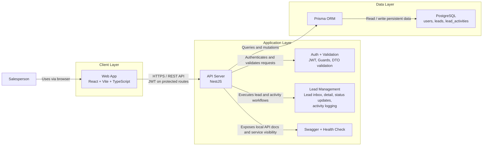

# 02. Architecture Diagram

## Diagram

## What the diagram shows

The architecture is intentionally simple and centered around a single user-facing workflow.

- The salesperson uses the web application in the browser.
- The web application is the only client and communicates with the backend over HTTP.
- The NestJS API owns authentication, request validation, and the lead/activity business workflow.
- Prisma acts as the API's data access layer.
- PostgreSQL is the system of record for users, leads, and follow-up activities.

## Reading guide

1. The `Client Layer` contains the browser-based web application used by the salesperson.
2. The `Application Layer` contains the backend service and its core responsibilities.
3. The `Data Layer` contains the ORM and relational database used for persistence.
4. The main runtime path is:
   `Salesperson -> Web App -> API Server -> Prisma -> PostgreSQL`

## Why this level of detail is appropriate

- This challenge does not need a distributed or event-driven architecture.
- A single frontend, a single backend, and a single database are enough for the MVP.
- The diagram still highlights the most important concerns: user entry point, API boundary, authentication, business logic, and persistent storage.

## Design note

Swagger and the health endpoint are shown as supporting backend capabilities rather than separate runtime services.

That keeps the diagram aligned with the real implementation while still making observability and API inspection visible in the system design.
