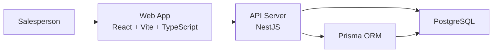

# 02. Architecture Diagram

## Diagram

## Reading guide

- The salesperson interacts with the web application.
- The web application calls the backend API over HTTP.
- The backend API handles authentication, validation, and business logic.
- Prisma is used inside the API layer to read and write PostgreSQL data.

## Diagram notes

- This is a deliberately lightweight architecture for an interview challenge.
- The backend is a single deployable service rather than a distributed system.
- The data model centers around users, leads, and lead activities.
